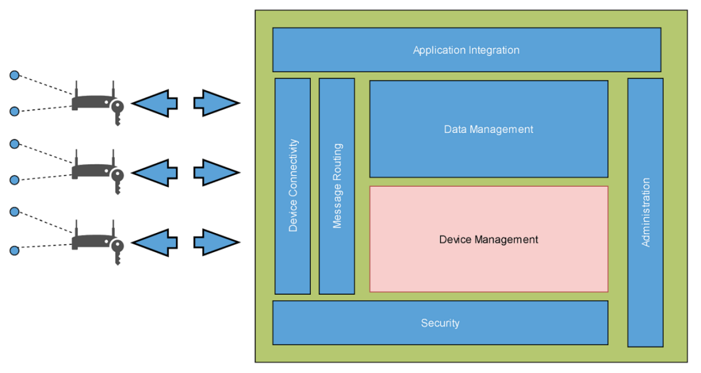
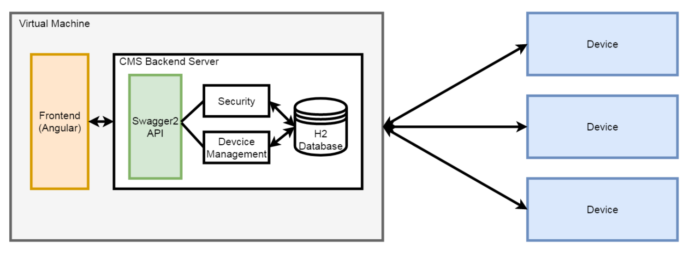

# cms-project #

本專題是與盛翔科技股份有限公司 (Centron Design) (https://www.centron.tw) 合作，改善其現有產品的設備管理系統和應用程式，名為 **CMS (Content Management System)**。因為現有的CMS系統缺乏部分功能，操作畫面也較為陽春，因此，本專題對此系統進行 (1) 修改操作畫面、數據顯示 (2) 增加新的管理功能，使操作畫面更整潔，功能更齊全，使用者體驗更好。

## 介紹 ##

此設備管理系統的開發是基於 `Eclipse Kapua`。`Eclipse Kapua` 是 `Eclipse IoT` 開源項目下的一個模組化物聯網雲端平台，用於管理和整合設備及其數據，適用於任何物聯網應用的物聯網服務平台。

主要分為四個部分：
1. 連接 : 通過 `MQTT` 和其他協議將IoT設備連接到 `Kapua`。
2. 管理 : 管理設備應用程序、配置和資源啟動遠程管理。
3. 儲存和分析 : 儲存IoT設備發布的數據，以便快速分析和可視化到儀表板中。
4. 整合 : 通過靈活的訊息傳送路徑和 REST API 將 `Kapua` 服務和IoT應用程序整合。

整個 `Kapua` 的架構圖如下:

    

因此這套CMS系統是把設備當成物聯網裝置來進行管理，而本專題所開發的部分是專注在設備管理的模組，開發時所需要的技能如下 :
- 語言 : `HTML` `CSS` `TypeScript` `Java`
- 前端 : `Angular框架`
- 後端 : `Java Transaction API` `Eclipse Kapua` `Apache Maven` `H2 Database`
- 其他 : `Vagrant` (用於伺服器虛擬機的建立)

如下圖所示，前後端程式碼開發完後，使用 `Vagrant` 將程式碼整合至虛擬機裡面，以方便伺服器的發行與部署。

    

## 特色 ##

- 使用隱藏式選單，避免佔用版面。
- 建立儀表板(資料總覽)，將設備的重要數據使用圖形與捲軸表示，更為清楚。
- 明確規範各帳號與設備的使用權限。
- 使用群組功能，可以輕鬆管理子帳號或設備。
- 新增訊息頁面，可用於各帳號與設備之間的訊息傳遞。